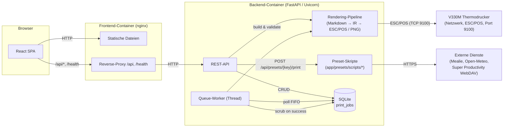
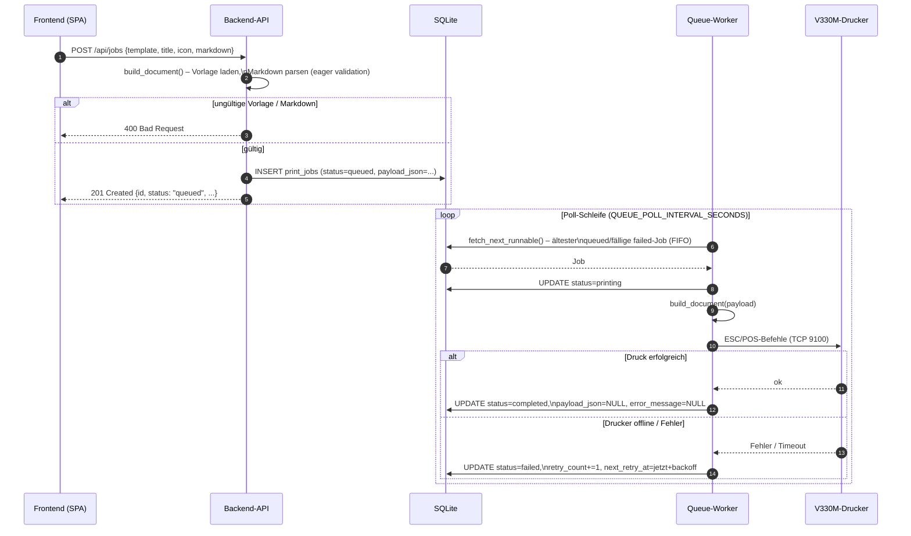
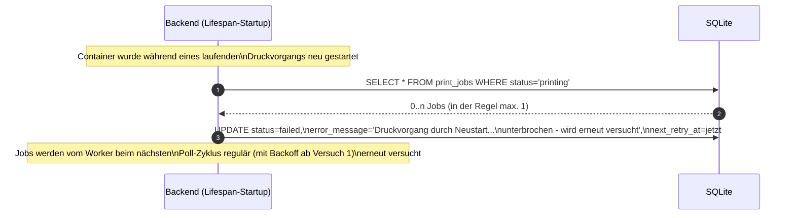
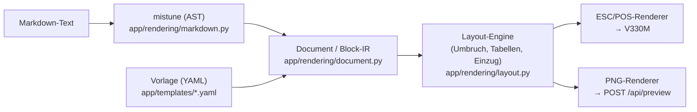

# Architektur

## Überblick

Bondrucker besteht aus zwei Containern, die über `docker-compose.yml` miteinander
verbunden sind, sowie einem externen, netzwerkfähigen ESC/POS-Drucker (V330M, 80mm,
TCP-Port 9100).

## Komponenten

- **Frontend-Container** (`frontend/`): React/TypeScript-SPA, gebaut mit Vite und von
  nginx als statische Dateien ausgeliefert. nginx leitet `/api/*` und `/health` an den
  Backend-Container weiter (siehe [`docker.md`](docker.md)). Aus Sicht des Browsers ist
  alles eine einzige Origin – kein CORS notwendig.
- **Backend-Container** (`backend/`): FastAPI-Anwendung (Uvicorn). Enthält:
  - die **REST-API** (`app/api/*`) für Jobs, Vorschau, Druckerstatus, Vorlagen,
    Standarddruckobjekte und Health-Check,
  - die **Preset-Skripte** (`app/presets/scripts/*`, siehe [`presets.md`](presets.md)),
    die bei `POST /api/presets/{key}/print` synchron im API-Prozess laufen und dabei
    ausgehende HTTPS-Aufrufe an externe Dienste (Mealie, Open-Meteo, Super
    Productivity WebDAV) machen können – im Gegensatz zu allen anderen Endpunkten
    macht die API hier also selbst Verbindungen nach außen, nicht nur der
    Queue-Worker zum Drucker,
  - die **Rendering-Pipeline** (`app/rendering/*`), die Markdown + Vorlage in eine
    druckerunabhängige Zwischendarstellung (`Document`) übersetzt, aus der sowohl
    ESC/POS-Befehle als auch die PNG-Vorschau erzeugt werden,
  - den **Queue-Worker** (`app/printing/worker.py`), einen Hintergrundthread, der die
    persistente Warteschlange abarbeitet und den Drucker über `app/printing/client.py`
    anspricht,
  - die **Datenschicht** (`app/repositories/jobs.py`, `app/database.py`,
    `app/models.py`) auf Basis von SQLite (WAL-Modus, gleichzeitiger Zugriff durch
    API-Threads und Worker-Thread).
- **SQLite-Datenbank**: einzelne Tabelle `print_jobs` (siehe
  [`database-schema.md`](database-schema.md)), als Datei in einem Docker-Volume
  persistiert.
- **V330M-Drucker**: wird ausschließlich vom Queue-Worker über
  `escpos.printer.Network` (TCP, Port 9100) angesprochen. Die API selbst greift nie
  direkt auf den Drucker zu (außer für den reinen Erreichbarkeits-Check in
  `GET /api/printer/status`).

## Ablauf: Druckauftrag erstellen und drucken

## Ablauf: Neustart während eines aktiven Druckauftrags

## Datenfluss Markdown → Ausgabe

Sowohl der ESC/POS-Renderer als auch die PNG-Vorschau verwenden dieselbe
Zwischendarstellung (`app/rendering/document.py`), wodurch die Vorschau exakt dem
gedruckten Ergebnis entspricht:

Details zur Markdown-Abbildung und zu nicht unterstützten Elementen siehe
[`markdown-mapping.md`](markdown-mapping.md).
