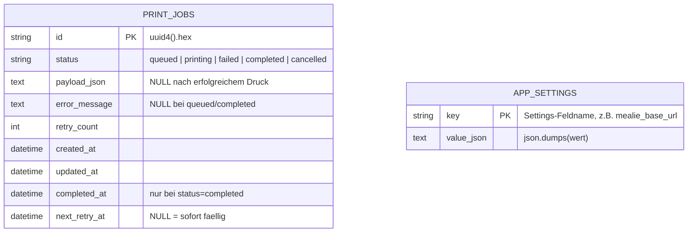

# Datenbankschema

SQLite-Datenbank mit zwei Tabellen, `print_jobs` und `app_settings` (siehe
`app/models.py`). SQLite läuft im **WAL-Modus** (`PRAGMA journal_mode=WAL`),
damit die API (mehrere FastAPI-Threadpool-Worker) und der Queue-Worker-Thread
gleichzeitig lesen/schreiben können, ohne `database is locked`-Fehler.

## DDL

```sql
CREATE TABLE print_jobs (
    id              VARCHAR(32)  NOT NULL PRIMARY KEY,   -- uuid4().hex
    status          VARCHAR(16)  NOT NULL,               -- siehe Statuswerte
    payload_json    TEXT,                                -- {template, title, icon, markdown} als JSON
    error_message   TEXT,                                -- letzte Fehlermeldung (deutsch)
    retry_count     INTEGER      NOT NULL DEFAULT 0,
    created_at      DATETIME     NOT NULL,               -- UTC, naive
    updated_at      DATETIME     NOT NULL,               -- UTC, naive; onupdate=jetzt
    completed_at    DATETIME,                            -- UTC, naive; gesetzt bei status=completed
    next_retry_at   DATETIME                             -- UTC, naive; frühester nächster Versuch
);

CREATE INDEX ix_print_jobs_status ON print_jobs (status);
CREATE INDEX ix_print_jobs_next_retry_at ON print_jobs (next_retry_at);

CREATE TABLE app_settings (
    key             VARCHAR(64)  NOT NULL PRIMARY KEY,    -- Settings-Feldname, z. B. "mealie_base_url"
    value_json      TEXT         NOT NULL                 -- json.dumps(wert)
);
```

`app_settings` speichert Web-Overrides für die in
`app.config.WEB_SETTINGS_FIELDS` gelisteten Felder (Preset-Integrationen) -
siehe [`configuration.md`](configuration.md). Eine Zeile existiert nur, wenn
das Feld über die Web-App gesetzt wurde; ein per `.env` gesperrtes Feld
ignoriert eine eventuell vorhandene Zeile (siehe
`app.config.get_effective_settings()`).

## ER-Diagramm



Es gibt absichtlich nur diese **zwei** Tabellen: Vorlagen und Presets sind
YAML-Dateien (kein DB-Zugriff dafür), und es existiert keine separate
"Verlaufstabelle" – siehe Datenschutz-Modell unten.

## Statuswerte (`JobStatus`)

| Status | Bedeutung | Vom Worker erneut versuchbar? |
|---|---|---|
| `queued` | Neu erstellt, wartet auf den ersten Druckversuch. | ja |
| `printing` | Wird gerade gedruckt (genau ein Job zu jedem Zeitpunkt). | nein (laufend) |
| `failed` | Letzter Versuch fehlgeschlagen; `next_retry_at` gesetzt. | ja, sobald `next_retry_at <= jetzt` |
| `completed` | Erfolgreich gedruckt. Inhalt wurde gelöscht (siehe unten). | nein (terminal) |
| `cancelled` | Vom Benutzer abgebrochen (nur aus `queued`/`failed` möglich). | nein (terminal) |

## FIFO-Auswahl (`fetch_next_runnable`)

```sql
SELECT * FROM print_jobs
WHERE status = 'queued'
   OR (status = 'failed' AND next_retry_at IS NOT NULL AND next_retry_at <= :now)
ORDER BY created_at
LIMIT 1;
```

Die Sortierung nach `created_at` (nicht `updated_at` oder `next_retry_at`) stellt
sicher, dass ein wiederholter (fehlgeschlagener, aber inzwischen fälliger) Job nicht
vor einem später erstellten, noch nicht versuchten Job verarbeitet wird –
"echte" FIFO über Wiederholungsversuche hinweg.

## Retry-Backoff

Bei einem Fehler (`mark_failed`) wird `retry_count` erhöht und

```
next_retry_at = jetzt + min(RETRY_BASE_DELAY_SECONDS * 2^retry_count, RETRY_MAX_DELAY_SECONDS)
```

gesetzt. Es gibt **keine** Obergrenze für `retry_count` – Wiederholungen erfolgen
unbegrenzt, bis der Job erfolgreich gedruckt oder manuell abgebrochen wird
(`DELETE /api/jobs/{id}`).

## Datenschutz: Inhalte nach erfolgreichem Druck

`JobRepository.mark_completed()` setzt bei `status=completed`:

- `payload_json = NULL` (löscht `template`, `title`, `icon`, `markdown`),
- `error_message = NULL`,
- `next_retry_at = NULL`,
- `completed_at = jetzt`.

Erhalten bleiben dauerhaft nur `id`, `status`, `created_at`, `updated_at`,
`completed_at` und `retry_count` (Zähler, kein Inhalt). Für **nicht** erfolgreich
abgeschlossene Jobs (`queued`, `printing`, `failed`, `cancelled`) bleiben
`payload_json` und `error_message` erhalten, damit der Auftrag angezeigt, erneut
versucht oder abgebrochen werden kann. Es existiert keine zusätzliche Tabelle, die
gedruckte Inhalte protokolliert – siehe [`security.md`](security.md) für das
vollständige Datenschutzkonzept.

## Migrations-Strategie

`init_db()` ruft beim Start `Base.metadata.create_all()` auf (idempotent, legt
fehlende Tabellen/Indizes an, ändert aber keine bestehenden Spalten). Für dieses
Single-Table-Schema ist das ausreichend; ein Schema-Migrationswerkzeug (z. B.
Alembic) ist bei zukünftigen Spaltenänderungen nachzurüsten (siehe
[`self-review.md`](self-review.md)).
